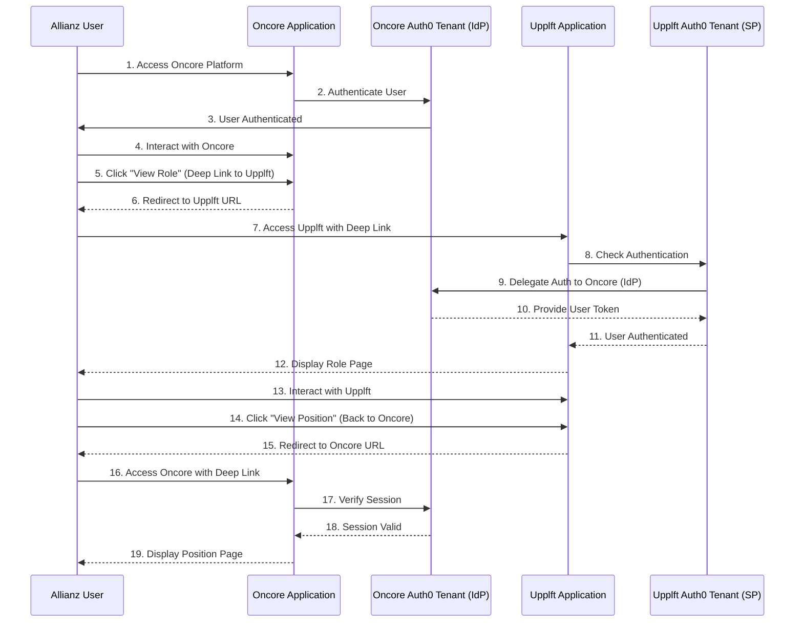

# SSO Integration and Implementation Document for Allianz

## Table of Contents

1. [Introduction](#1-introduction)
2. [Overview](#2-overview)
3. [Requirements](#3-requirements)
4. [Architecture](#4-architecture)
5. [Technical Implementation](#5-technical-implementation)
6. [Technical Steps](#6-technical-steps)
7. [Security Considerations](#7-security-considerations)
8. [Testing Scenarios](#8-testing-scenarios)
9. [Deployment Checklist](#9-deployment-checklist)
10. [Monitoring and Maintenance](#10-monitoring-and-maintenance)
11. [Support and Troubleshooting](#11-support-and-troubleshooting)

---

## 1. Introduction

### Purpose of the Document

This document outlines the Single Sign-On (SSO) integration plan between **Upplft** and **Oncore** for the client **Allianz**. It details the technical implementation, security considerations, testing scenarios, deployment steps, and maintenance procedures to ensure a seamless authentication experience for Allianz users across both platforms.

### Audience

- Technical teams at Upplft and Oncore
- Allianz IT and security teams
- Project managers and stakeholders involved in the SSO integration

---

## 2. Overview

### Background

Allianz currently uses or will be using:

- **Upplft**: For hiring, interviews, and sending job offers.
- **Oncore**: For employee contracts, payroll, and timesheet management.

Currently, Allianz users must log in separately to both platforms. To enhance user experience and efficiency, we aim to implement SSO, allowing Allianz users to authenticate once and access both platforms seamlessly.

### Objectives

- **Unified Authentication**: Enable Allianz users to log in once via Oncore and access both Upplft and Oncore.
- **Seamless Navigation**: Allow users to navigate between Upplft and Oncore without additional logins.
- **Deep Linking**: Enable users to navigate directly to specific sections or items between platforms.
- **Access Control**: Ensure only authorized Allianz users can access Upplft.
- **User Account Linking**: Map user accounts between Upplft and Oncore to maintain a consistent user identity.

---

## 3. Requirements

### Requirement 1

**SSO Functionality**: Allianz can log in to Upplft or Oncore and navigate between them without signing in again. Since Oncore holds the original source of Allianz users, Oncore's Auth0 tenant will act as the Identity Provider (IdP).

### Requirement 2

**Navigation from Oncore to Upplft**: Allianz can log in to Oncore and, once a Position is approved (and a draft role created in Upplft), they can select "View Role" and be taken to Upplft to update and post the role.

### Requirement 3

**Navigation from Upplft to Oncore**: Allianz can navigate from a role in Upplft back to a Position in Oncore.

---

## 4. Architecture

### High-Level Architecture Diagram

### **Authentication and Navigation Flow**

1.  **User Accesses Oncore Platform**
    
    -   **Step 1**: The **Allianz User** accesses the **Oncore Application**.
2.  **Authentication at Oncore**
    
    -   **Steps 2-3**: The **Oncore Application** directs the user to authenticate via the **Oncore Auth0 Tenant (IdP)**.
    -   **Step 3**: Upon successful authentication, the user is authenticated.
3.  **User Interacts with Oncore**
    
    -   **Step 4**: The user performs actions within the **Oncore Application**.
4.  **Navigation from Oncore to Upplft**
    
    -   **Step 5**: The user clicks on "View Role", initiating a deep link to Upplft.
    -   **Step 6**: The **Oncore Application** redirects the user to the **Upplft** URL with necessary parameters (e.g., role ID).
5.  **Accessing Upplft Application**
    
    -   **Step 7**: The user accesses the **Upplft Application** using the deep link.
    -   **Step 8**: The **Upplft Application** checks if the user is authenticated.
    -   **Step 9**: Since the user is not authenticated on Upplft, it delegates authentication to the **Upplft Auth0 Tenant (SP)**, which in turn delegates to the **Oncore Auth0 Tenant (IdP)**.
    -   **Step 10**: The **Oncore Auth0 Tenant** provides a user token to the **Upplft Auth0 Tenant**.
    -   **Step 11**: The **Upplft Auth0 Tenant** confirms the user is authenticated.
6.  **Displaying Role Page in Upplft**
    
    -   **Step 12**: The **Upplft Application** displays the specific role page to the user.
7.  **User Interacts with Upplft**
    
    -   **Step 13**: The user interacts with the **Upplft Application**.
8.  **Navigation from Upplft back to Oncore**
    
    -   **Step 14**: The user clicks on "View Position" to return to Oncore.
    -   **Step 15**: The **Upplft Application** redirects the user to the **Oncore** URL with necessary parameters (e.g., position ID).
9.  **Accessing Oncore Application Again**
    
    -   **Step 16**: The user accesses the **Oncore Application** using the deep link.
    -   **Step 17**: The **Oncore Application** verifies the user's session with the **Oncore Auth0 Tenant**.
    -   **Step 18**: The **Oncore Auth0 Tenant** confirms the session is valid.
    -   **Step 19**: The **Oncore Application** displays the specific position page to the user.

---

## 5. Technical Implementation

### Technology Stack

- **Auth0**: Cloud-based identity platform for authentication and authorization.
- **OpenID Connect (OIDC)**: Authentication protocol built on OAuth 2.0 for federated identity.
- **React**: Frontend framework used for building the user interface.
- **Auth0 React SDK**: Library for integrating Auth0 authentication in React applications.

### Authentication Flow

1. **User Initiates Login**:
   - Allianz user attempts to access Oncore (or Upplft).

2. **Redirect to Oncore's Auth0 Tenant**:
   - If accessing Upplft, the user is redirected to Oncore's Auth0 tenant for authentication.

3. **Authentication**:
   - User authenticates using their credentials managed by Oncore.

4. **Token Issuance**:
   - Oncore's Auth0 tenant issues ID and access tokens.

5. **Access Granted**:
   - User gains access to both Upplft and Oncore without additional logins.

6. **Navigation with Deep Links**:
   - Users navigate between platforms using links that include necessary parameters to direct them to specific pages.

### User Account Linking

- Since Oncore's Auth0 tenant is the IdP, user identities are consistent across both platforms.
- Upplft relies on information from Oncore's tokens to identify and authorize users.

---

## 6. Technical Steps (POC)

### 6.1 Setting Up Test Tenants

- **Oncore Test Tenant**: `oncore-sso-test` (IdP)
- **Upplft Test Tenant**: `upplft-sso-test` (SP)

These tenants simulate the production environment to validate the SSO integration before deployment.

### 6.2 Configuring Auth0 Tenants

#### Oncore Auth0 Tenant (Identity Provider)

1. **Ensure Allianz Users Exist**:
   - Verify that Allianz users are present in Oncore's Auth0 tenant.

2. **Create an API (if necessary)**:
   - Name: `UpplftAPI`
   - Identifier: `https://upplft.com/api`

3. **Configure Allowed Callback URLs**:
   - Add Upplft's callback URL to Oncore's Auth0 tenant:
     - e.g., `https://upplft.com/callback`

4. **Expose OIDC Configuration**:
   - The issuer URL will be `https://oncore-sso-test.auth0.com/`
   - Discovery document at `https://oncore-sso-test.auth0.com/.well-known/openid-configuration`

5. **Create a Client Application for Upplft**:
   - Name: `Upplft-SP`
   - Type: Regular Web Application
   - Grant Types: Enable **Client Credentials** and **Authorization Code**

6. **Provide Credentials to Upplft**:
   - Share Client ID and Client Secret securely.
   - Provide the OpenID Configuration URL.

#### Upplft Auth0 Tenant (Service Provider)

1. **Create an OIDC Identity Provider Connection**:
   - Navigate to **Connections > Enterprise > OpenID Connect**.
   - Create a new connection named `Oncore-IdP`.

2. **Configure the OIDC Connection**:
   - **Issuer URL**: `https://oncore-sso-test.auth0.com/`
   - **Client ID** and **Client Secret**: Provided by Oncore.
   - **Scopes**: Ensure necessary scopes are included (e.g., `openid`, `profile`, `email`).

3. **Enable the Connection for Upplft Application**:
   - Go to **Applications** in Upplft's Auth0 dashboard.
   - Select the Upplft application.
   - In the **Connections** tab, enable the `Oncore-IdP` connection.

4. **Configure Allowed Callback URLs**:
   - Ensure Upplft's application has the correct callback URLs configured.

### 6.3 Implementing Authentication in Upplft

1. **Update Auth0 Configuration in Upplft Application**:
   - Use the Auth0 React SDK to integrate authentication.
   - Set the **domain** to Upplft's Auth0 tenant.
   - Set the **connection** parameter to `Oncore-IdP` when initiating authentication.

2. **Handle Authentication Responses**:
   - Upon successful authentication, extract user information from the ID token.
   - Use the user's email or unique identifier to manage user sessions.

3. **Access Control**:
   - Implement logic to authorize users based on their roles and permissions received from Oncore or delegate from Upplft itself through admin accounts

### 6.4 Linking User Accounts and Data

- **User Identity**:
  - Use the `sub` claim in the ID token as the unique user identifier.
- **User Metadata**:
  - Map user attributes from Oncore to Upplft's user model.
- **Provisioning Users**:
  - Implement Just-In-Time (JIT) provisioning to create user accounts in Upplft upon first login.

### 6.5 Implementing Navigation Flows

#### From Oncore to Upplft

1. **"View Role" Feature**:
   - In Oncore, implement a link or button labeled "View Role".
   - Construct a URL to Upplft that includes necessary parameters (e.g., role ID).

2. **Deep Link Handling in Upplft**:
   - Upon arrival, Upplft checks if the user is authenticated.
   - If not authenticated, redirect to Oncore's Auth0 tenant for authentication.
   - After authentication, redirect the user to the intended role page.

#### From Upplft to Oncore

1. **"View Position" Feature**:
   - In Upplft, implement a link or button labeled "View Position".
   - Construct a URL to Oncore that includes necessary parameters (e.g., position ID).

2. **Deep Link Handling in Oncore**:
   - Upon arrival, Oncore checks if the user is authenticated.
   - If not authenticated, initiate authentication (though users should already be authenticated via SSO).
   - Redirect the user to the intended position page.

---

## 7. Security Considerations

### Session Management

- **Session Synchronization**:
  - Ensure that session timeouts are consistent across both platforms.
- **Token Security**:
  - Store tokens securely using HTTP-only cookies or secure storage.

### Data Protection

- **Sensitive Data Handling**:
  - Do not expose sensitive information in URLs or logs.
- **Encryption**:
  - Enforce HTTPS for all communications.

### Access Control

- **Role-Based Access Control (RBAC)**:
  - Use roles and permissions provided by Oncore's Auth0 tenant (If any).
- **Authorization Checks**:
  - Implement checks in Upplft to ensure users have appropriate access.

### Compliance

- **GDPR and Data Privacy**:
  - Ensure compliance with relevant data protection laws.
- **User Consent**:
  - Update privacy policies and obtain necessary consents from users.

---

## 8. Testing Scenarios

### Test Cases

1. **SSO Login and Seamless Navigation**:
   - Verify that users can log in via Oncore and access Upplft without re-authenticating.

2. **Deep Linking from Oncore to Upplft**:
   - Test the "View Role" link redirects to the correct role in Upplft.

3. **Deep Linking from Upplft to Oncore**:
   - Test the navigation back to the specific position in Oncore.

4. **Authentication Handling**:
   - Test behavior when a user is not authenticated and accesses a deep link.

5. **Access Control Enforcement**:
   - Ensure unauthorized users cannot access resources they shouldn't.

6. **Session Expiry and Renewal**:
   - Test session expiration handling and token renewal processes.

### Expected Results

- **Seamless User Experience**:
  - Users navigate between platforms without interruption.
- **Security Integrity**:
  - Unauthorized access is prevented.
- **Correct Resource Access**:
  - Users are directed to the intended pages.

---

## 9. Deployment Checklist

### Pre-Deployment Activities

- **Configuration Verification**:
  - Verify all Auth0 settings and OIDC configurations.
- **Code Review**:
  - Ensure code changes are secure and meet best practices.
- **Stakeholder Communication**:
  - Inform Allianz and internal teams of deployment plans.

### Deployment Steps

1. **Update Auth0 Configurations in Production**:
   - Apply test tenant settings to production tenants.

2. **Deploy Application Updates**:
   - Release updated versions of Upplft and Oncore applications.

3. **Enable SSO Functionality**:
   - Activate new authentication flows in production.

### Post-Deployment Verification

- **Functional Testing**:
  - Perform end-to-end tests in the production environment.
- **Monitor System Logs**:
  - Watch for errors or unusual activity.

---

## 10. Monitoring and Maintenance

### Monitoring Tools

- **Auth0 Monitoring**:
  - Use Auth0's analytics to track authentication metrics.
- **Application Monitoring**:
  - Use Sentry for performance and error tracking.

### Maintenance Procedures

- **Regular Updates**:
  - Keep SDKs and dependencies up to date.
- **Security Audits**:
  - Conduct periodic security assessments.
- **User Management**:
  - Regularly review user access levels and deactivate inactive accounts.

---

## 11. Support and Troubleshooting

Use Oncore-upplft-integration channel in slack for:

1.  SSO-specific issues
    
2.  Cross-platform navigation problems
    
3.  Token/Session related issues

### Common Issues and Resolutions

1. **User Cannot Access Upplft After Logging into Oncore**:
   - **Resolution**: Verify that the OIDC connection is properly configured in Upplft's Auth0 tenant.

2. **Deep Link Redirect Fails**:
   - **Resolution**: Ensure the URL parameters are correct and the target resource exists.

3. **Authentication Errors in Upplft**:
   - **Resolution**: Confirm that Upplft's application is correctly using the OIDC connection to Oncore's Auth0 tenant.

4. **Access Denied to Specific Resources**:
   - **Resolution**: Verify user roles and permissions; adjust RBAC settings if necessary.

---

*Prepared by: Upplft*  
*Date: 11th Nov 2024*

